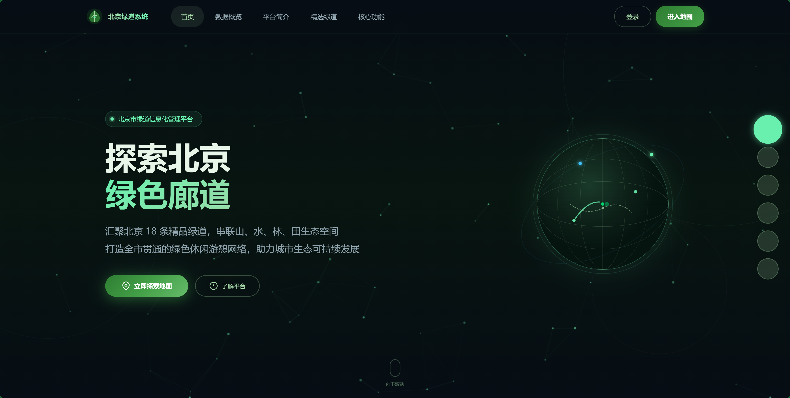
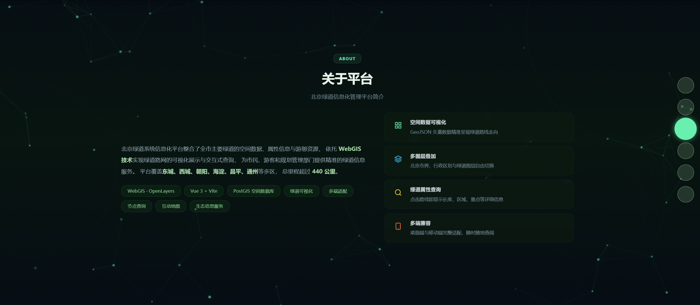
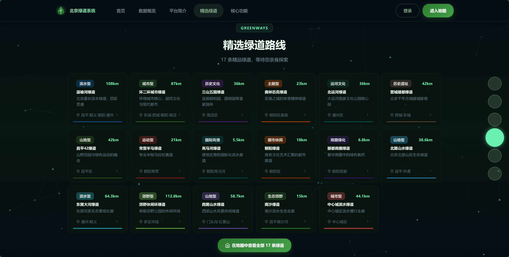
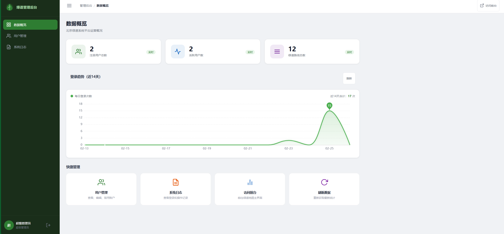
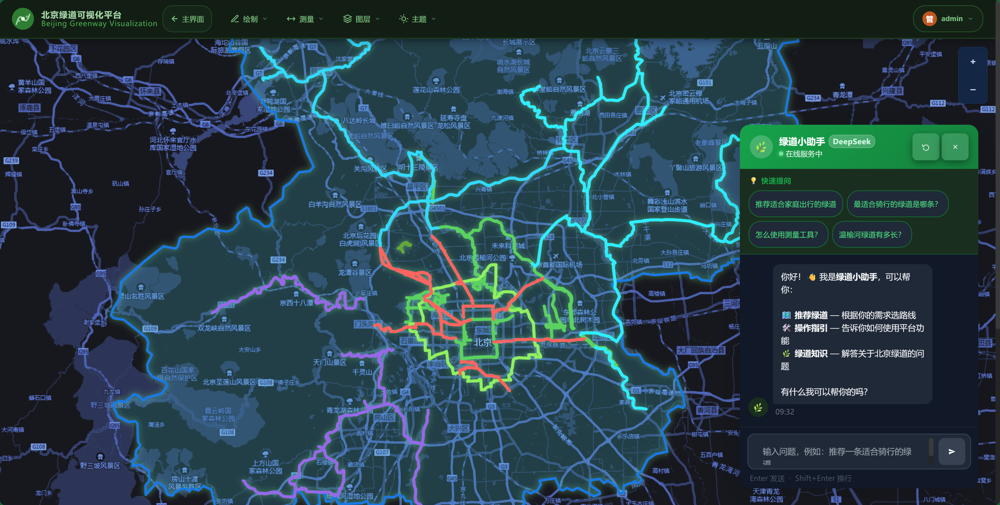
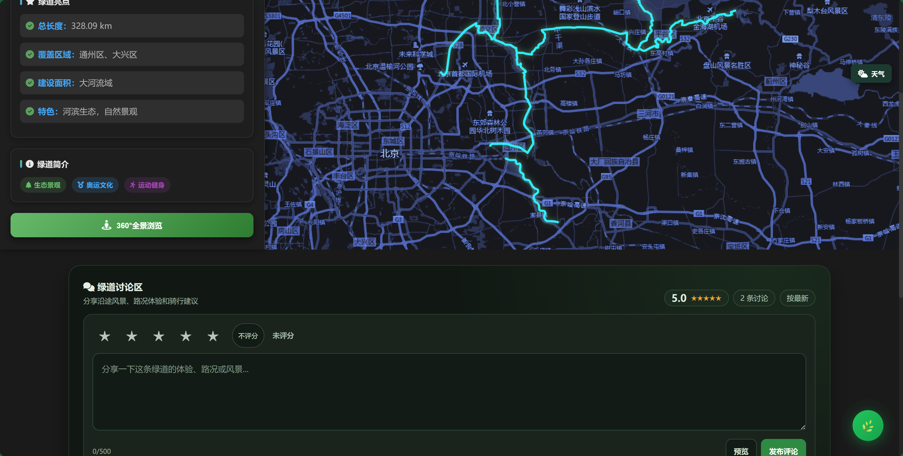

# Beijing Greenway System Visualization Platform


A modern WebGIS platform for exploring Beijing's greenway network, built with Vue 3 + OpenLayers + PostgreSQL/PostGIS.

**[English](./README.md) | [中文](./README_zh-CN.md)**

> ⚡ **Quick Start?** See the [**快速部署指南.md**](./快速部署指南.md) for complete setup instructions (PostgreSQL + Node.js configuration included)

---

##  Screenshots

### Landing Page  Hero Section


### Interactive Map Overview


### Greenway Detail Page


### GIS Toolbar & Layer Control


### Admin Dashboard


### Mobile-Responsive View


---

##  Project Overview

Interactive visualization of **12 major Beijing greenways** featuring a fullscreen landing page, an interactive OpenLayers map, GIS tools, real-time weather, panoramic street view, admin panel, user auth, and a Capacitor-based mobile app.

-  12 complete greenway routes
-  Vue 3 + OpenLayers 8 frontend
-  Node.js + Express REST API backend
-  PostgreSQL + PostGIS geospatial database
-  Fullpage landing page with debounced mouse-wheel scroll (6 sections)
-  Layer control integrated into top navigation bar
-  Admin panel with JWT authentication (localStorage, persists across tabs)
-  Admin login state reflected in frontend navbar
-  RGB color picker for all drawing tools (point / line / polygon)
-  Map canvas export to PNG
-  Back-to-homepage button in map navigation bar
-  User login / registration system
-  Full dark theme + responsive design
-  Capacitor-based mobile app (experimental)

---

##  Quick Start

### One-Command (Windows)
```bash
.\启动完整系统.bat
```
Opens two terminals  backend on port **3001** and frontend on port **5173**.

### Manual

**Backend:**
```bash
cd greenway-backend
npm install
npm run db:init   # initialise PostgreSQL + PostGIS tables
npm run dev       # http://localhost:3001
```

**Frontend (new terminal):**
```bash
cd greenway-vue
npm install
npm run dev       # http://localhost:5173
```

---

##  Core Features

| Feature | Description |
|---------|-------------|
|  **Landing Page** | Fullpage debounced mouse-wheel scroll, 6 animated sections, 0.6s transition |
|  **Interactive Map** | OpenLayers multi-layer rendering with custom dark tile theme |
|  **GIS Toolkit** | Draw (with RGB color picker), measure, import GeoJSON, toggle base layers |
|  **Map Export** | Export current map view as PNG image |
|  **12 Greenways** | Individual detail pages with attributes & street panorama |
|  **Real-time Weather** | Draggable weather widget (Amap API) |
|  **Dark Mode** | Full-site dark theme (`#060d14` base), admin panel fully themed |
|  **Admin Panel** | JWT auth (localStorage), dashboard, user management, logs |
|  **User Auth** | Public user registration and login |
|  **Mobile App** | Capacitor + Vue 3, auto-detected on native platform |

---

##  Project Structure

```
 greenway-backend/           # Node.js + Express + DB
    src/
       index.js            # API entry point
       db.js               # PostgreSQL connection pool
    scripts/                # DB init & GeoJSON import utilities
    init-db.sql             # Schema + PostGIS setup

 greenway-vue/               # Vue 3 frontend (Vite)
    src/
       views/
          LandingPage.vue          # /   fullpage homepage
          GreenwayOverview.vue     # /map  main map view
          *Detail.vue              # /wenyu  /chaoyang (12 pages)
          UserLogin.vue            # /login
          UserRegister.vue         # /register
          admin/                   # /admin/* (auth-protected)
       components/
          TopNavbar.vue            # Navigation bar + layer dropdown
          MapViewer.vue            # OpenLayers map wrapper
          MapToolbar.vue           # GIS tools (draw/measure/layers)
          WeatherCard.vue          # Draggable weather widget
          PanoramaViewer.vue       # Street panorama viewer
       stores/
          adminAuth.js             # Pinia store (JWT, sessionStorage)
       router/index.js              # Routes + navigation guards
    public/数据/                     # GeoJSON geometry files

 示例图片/                   # Project screenshots used in this README
 README.md                   # English documentation (this file)
 README_zh-CN.md             # Chinese documentation
 启动完整系统.bat            # One-command startup script (Windows)
```

---

##  Route Overview

| Path | Component | Description |
|------|-----------|-------------|
| `/` | LandingPage | Fullpage hero landing |
| `/map` | GreenwayOverview | Main interactive map |
| `/wenyu` | WenyuDetail | 温榆河绿道 |
| `/huanerhuan` | HuanerhuanDetail | 环二环城市绿道 |
| `/liangmahe` | LiangmaheDetail | 亮马河绿道 |
| `/changying` | ChangyingDetail | 常营半马绿道 |
| `/changping42` | Changping42Detail | 昌平42绿道 |
| `/lidu` | LiduDetail | 丽都商圈绿道 |
| `/beiyunhe` | BeiyunheDetail | 北运河绿道 |
| `/nansha` | NanshaDetail | 南沙绿道 |
| `/aosen` | AosenDetail | 奥林匹克森林公园绿道 |
| `/yingcheng` | YingchengDetail | 营城建都绿道 |
| `/sanshan` | SanshanDetail | 三山五园绿道 |
| `/chaoyang` | ChaoyangDetail | 朝阳绿道 |
| `/login` | UserLogin | User login |
| `/register` | UserRegister | User registration |
| `/admin/login` | AdminLogin | Admin login |
| `/admin/dashboard` | AdminDashboard | Admin overview *(auth required)* |
| `/admin/users` | AdminUsers | User management *(auth required)* |
| `/admin/logs` | AdminLogs | System logs *(auth required)* |
| `/mobile/*` | MobileLayout | Mobile app (Capacitor) |

---

##  12 Greenways

| # | Name | Length | Key Feature |
|----|------|--------|-------------|
| 1 | 温榆河绿道 (Wenyu River) | 108 km | Waterfront ecological corridor |
| 2 | 环二环城市绿道 (Ring Road 2) | 87 km | Urban ring greenway loop |
| 3 | 亮马河绿道 (Liangma River) | 5.5 km | Business district waterway |
| 4 | 常营半马绿道 (Changying) | 21 km | Half-marathon track |
| 5 | 昌平42绿道 (Changping 42) | 42 km | Marathon-length mountain route |
| 6 | 丽都商圈绿道 (Lido) | 6.8 km | Commercial district loop |
| 7 | 北运河绿道 (Bei Yunhe) | 36 km | Canal-side greenway |
| 8 | 南沙绿道 (Nansha) | 15 km | Southern ecological belt |
| 9 | 奥林匹克森林公园绿道 (Olympic Forest) | 23 km | Olympic park perimeter |
| 10 | 营城建都绿道 (Yingcheng) | 42 km | Historical heritage route |
| 11 | 三山五园绿道 (Sanshan) |  | Imperial gardens & landscape |
| 12 | 朝阳绿道 (Chaoyang) |  | North Chaoyang district loop |

---

##  API Endpoints

```http
GET /api/greenways              # all greenways (summary list)
GET /api/greenways?name=温榆河  # filter by name  GeoJSON FeatureCollection
```

```bash
curl "http://localhost:3001/api/greenways?name=南沙"
```

---

##  Database Schema

```sql
CREATE TABLE greenways (
  id                SERIAL PRIMARY KEY,
  name              VARCHAR(100) NOT NULL,
  total_length      DECIMAL(10, 2),
  coverage_area     VARCHAR(255),
  construction_area DECIMAL(10, 2),
  features          TEXT,
  description       TEXT,
  geometry          geometry(MultiLineString, 4326),
  created_at        TIMESTAMP DEFAULT CURRENT_TIMESTAMP
);
```

- **Geometry:** `MultiLineString` preserves independent segments
- **CRS:** SRID 4326 (WGS 84)
- **Spatial API:** PostGIS `ST_AsGeoJSON()` for GeoJSON serialization

---

##  Environment Configuration

**Backend (`greenway-backend/.env.local`)**
```env
DB_HOST=localhost
DB_NAME=greenway
DB_USER=postgres
DB_PASSWORD=your_password
PORT=3001
JWT_SECRET=your_jwt_secret
```

**Frontend (`greenway-vue/.env.local`)**
```env
VITE_AMAP_KEY=your_amap_key
VITE_BAIDU_MAP_KEY=your_baidu_key
VITE_API_BASE=http://localhost:3001
```

---

##  Design System

| Token | Value | Usage |
|-------|-------|-------|
| Background | `#060d14` | Global dark base |
| Primary green | `#2E7D32` / `#4CAF50` | Buttons, accents |
| Highlight | `#69F0AE` | Active / hover states |
| Muted green | `#A5D6A7` | Secondary text |
| Boundary blue | `#1565C0` | Map district outline layer |

---

##  Security

- Admin JWT stored in **localStorage** (persists across tabs and page refreshes; cleared only on explicit logout or 401)
- Vue Router navigation guards enforce `requiresAdmin` meta flag
- 401 responses auto-clear session and redirect to admin login
- Parameterized DB queries prevent SQL injection
- CORS configured for local development only

---

## Technology Stack

| Layer | Technology |
|-------|-----------|
| Frontend framework | Vue 3.4 + Vite 5 + Pinia |
| Map engine | OpenLayers 8.2 |
| Backend | Node.js 18 + Express 4.18 |
| Database | PostgreSQL 18 + PostGIS 3.6 |
| Mobile | Capacitor 5 |
| Data format | GeoJSON + MultiLineString (SRID 4326) |

---

##  Competition & Intellectual Property

Developed for a technical competition; software copyright registration (软著申请) in progress.

-  Free for educational and research use
-  Commercial use or derivative works require author permission
-  Software copyright protection pending

##  License

MIT  see LICENSE for details.

---

**Built with  for Beijing's urban green spaces**
