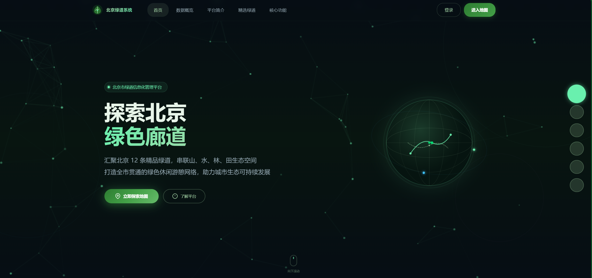
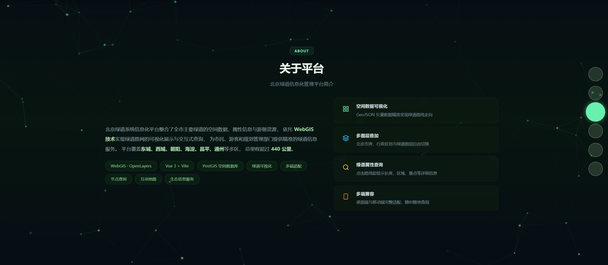
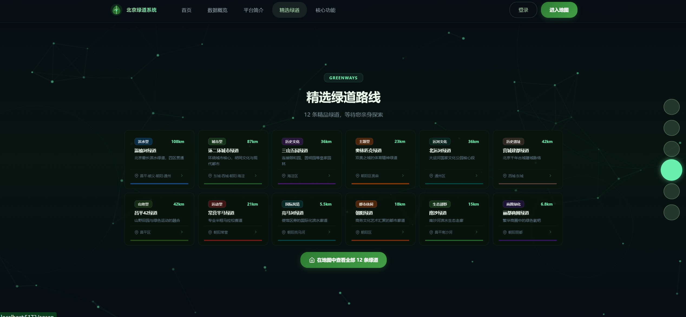
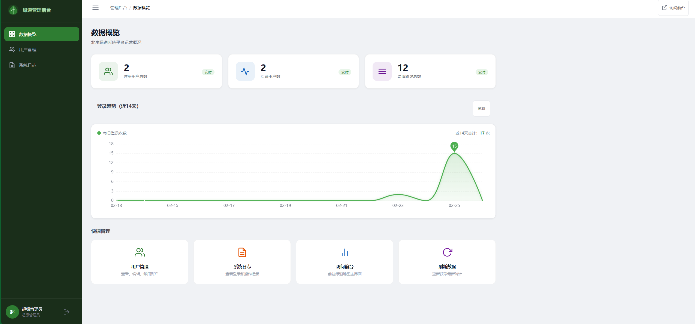
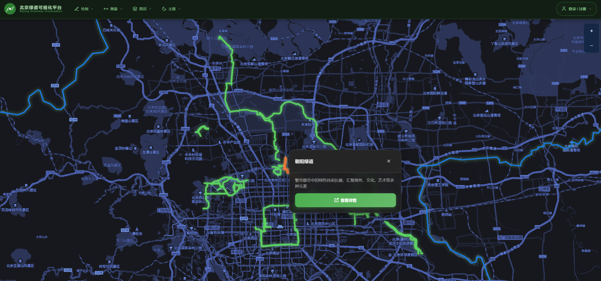
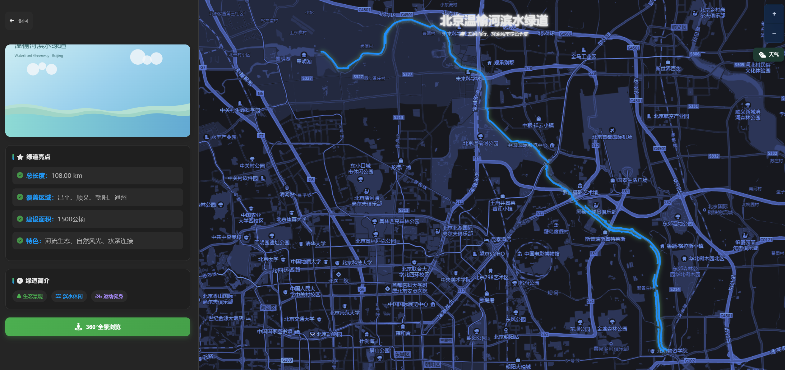

# 北京绿道信息可视化平台


基于 Vue 3 + OpenLayers + PostgreSQL/PostGIS 的现代 WebGIS 平台，交互式探索北京绿道网络。

**[English](./README.md) | [中文](./README_zh-CN.md)**

---



















---

##  项目简介

交互式可视化 **12 条北京主要绿道**，集成全屏落地页、OpenLayers 交互地图、GIS 工具集、实时天气、全景街景、管理后台、用户认证及 Capacitor 移动端应用。

-  12 条完整绿道路线（新增三山五园绿道、朝阳绿道）
-  Vue 3 + OpenLayers 8 前端，Pinia 状态管理
-  Node.js + Express REST API 后端
-  PostgreSQL + PostGIS 地理数据库
-  全屏落地页，鼠标滚轮六屏切换
-  图层控制集成到顶部导航栏下拉菜单
-  管理后台 JWT 认证（sessionStorage，关闭浏览器自动注销）
-  用户注册与登录系统
-  全站深色主题 + 响应式设计
-  Capacitor 移动端应用（试验阶段）

---

##  快速开始

### 一键启动（Windows）
```bash
.\启动完整系统.bat
```
自动打开两个终端：后端监听 **3001** 端口，前端监听 **5173** 端口。

### 手动启动

**后端：**
```bash
cd greenway-backend
npm install
npm run db:init   # 初始化 PostgreSQL + PostGIS 表结构
npm run dev       # http://localhost:3001
```

**前端（新终端）：**
```bash
cd greenway-vue
npm install
npm run dev       # http://localhost:5173
```

---

##  核心功能

| 功能 | 描述 |
|------|------|
|  **落地页** | 鼠标滚轮六屏全屏切换，动态过渡动画 |
|  **交互式地图** | OpenLayers 多图层高性能渲染，自定义深色瓦片 |
|  **GIS 工具集** | 绘图、测量、导入 GeoJSON、基础图层切换 |
|  **12 条绿道** | 每条均有独立详情页、属性信息和全景街景 |
|  **实时天气** | 可拖动天气组件（高德地图 API） |
|  **深色主题** | 全站深色配色（`#060d14` 主背景） |
|  **管理后台** | JWT 认证（sessionStorage）、数据概览、用户管理、系统日志 |
|  **用户系统** | 公众用户注册与登录 |
|  **移动端** | Capacitor + Vue 3，原生平台自动跳转移动端布局 |

---

##  项目结构

```
 greenway-backend/           # Node.js + Express + 数据库
    src/
       index.js            # API 入口
       db.js               # PostgreSQL 连接池
    scripts/                # 数据库初始化与 GeoJSON 导入工具
    init-db.sql             # 表结构 + PostGIS 初始化

 greenway-vue/               # Vue 3 前端（Vite）
    src/
       views/
          LandingPage.vue          # /   首页落地页
          GreenwayOverview.vue     # /map  主地图页
          *Detail.vue              # /wenyu  /chaoyang（12个详情页）
          UserLogin.vue            # /login
          UserRegister.vue         # /register
          admin/                   # /admin/*（权限保护）
       components/
          TopNavbar.vue            # 顶部导航 + 图层下拉菜单
          MapViewer.vue            # OpenLayers 地图封装
          MapToolbar.vue           # GIS 工具（绘图/测量/图层）
          WeatherCard.vue          # 可拖动天气组件
          PanoramaViewer.vue       # 全景街景查看器
       stores/
          adminAuth.js             # Pinia Store（JWT、sessionStorage）
       router/index.js              # 路由配置 + 导航守卫
    public/数据/                     # GeoJSON 几何数据文件

 示例图片/                   # 项目截图（本文档引用）
 README.md                   # 英文文档
 README_zh-CN.md             # 中文文档（本文件）
 启动完整系统.bat            # 一键启动脚本（Windows）
```

---

##  路由总览

| 路径 | 组件 | 说明 |
|------|------|------|
| `/` | LandingPage | 全屏落地页 |
| `/map` | GreenwayOverview | 主交互地图 |
| `/wenyu` | WenyuDetail | 温榆河绿道详情 |
| `/huanerhuan` | HuanerhuanDetail | 环二环城市绿道详情 |
| `/liangmahe` | LiangmaheDetail | 亮马河绿道详情 |
| `/changying` | ChangyingDetail | 常营半马绿道详情 |
| `/changping42` | Changping42Detail | 昌平42绿道详情 |
| `/lidu` | LiduDetail | 丽都商圈绿道详情 |
| `/beiyunhe` | BeiyunheDetail | 北运河绿道详情 |
| `/nansha` | NanshaDetail | 南沙绿道详情 |
| `/aosen` | AosenDetail | 奥森绿道详情 |
| `/yingcheng` | YingchengDetail | 营城建都绿道详情 |
| `/sanshan` | SanshanDetail | 三山五园绿道详情 |
| `/chaoyang` | ChaoyangDetail | 朝阳绿道详情 |
| `/login` | UserLogin | 用户登录 |
| `/register` | UserRegister | 用户注册 |
| `/admin/login` | AdminLogin | 管理员登录 |
| `/admin/dashboard` | AdminDashboard | 数据概览 *（需登录）* |
| `/admin/users` | AdminUsers | 用户管理 *（需登录）* |
| `/admin/logs` | AdminLogs | 系统日志 *（需登录）* |
| `/mobile/*` | MobileLayout | 移动端布局（Capacitor） |

---

##  12 条绿道

| # | 名称 | 长度 | 特色 |
|----|------|------|------|
| 1 | 温榆河绿道 | 108 km | 滨水生态廊道 |
| 2 | 环二环城市绿道 | 87 km | 城市绿道环线 |
| 3 | 亮马河绿道 | 5.5 km | 商务区滨水绿道 |
| 4 | 常营半马绿道 | 21 km | 半马赛道级绿道 |
| 5 | 昌平42绿道 | 42 km | 全马长度山地绿道 |
| 6 | 丽都商圈绿道 | 6.8 km | 商圈休闲绿道 |
| 7 | 北运河绿道 | 36 km | 运河沿线绿道 |
| 8 | 南沙绿道 | 15 km | 南部生态绿廊 |
| 9 | 奥林匹克森林公园绿道 | 23 km | 奥森公园环绕绿道 |
| 10 | 营城建都绿道 | 42 km | 历史文化遗址绿道 |
| 11 | 三山五园绿道 |  | 皇家园林景观绿道 |
| 12 | 朝阳绿道 |  | 朝阳北部绿道环 |

---

##  API 端点

```http
GET /api/greenways              # 获取所有绿道列表
GET /api/greenways?name=温榆河  # 按名称筛选，返回 GeoJSON FeatureCollection
```

```bash
curl "http://localhost:3001/api/greenways?name=南沙"
```

---

##  数据库结构

```sql
CREATE TABLE greenways (
  id                SERIAL PRIMARY KEY,
  name              VARCHAR(100) NOT NULL,
  total_length      DECIMAL(10, 2),
  coverage_area     VARCHAR(255),
  construction_area DECIMAL(10, 2),
  features          TEXT,
  description       TEXT,
  geometry          geometry(MultiLineString, 4326),
  created_at        TIMESTAMP DEFAULT CURRENT_TIMESTAMP
);
```

- **几何类型：** `MultiLineString`，保留独立线段，避免错误连接
- **坐标系：** SRID 4326（WGS 84 标准）
- **数据序列化：** PostGIS `ST_AsGeoJSON()` 输出 GeoJSON 格式

---

##  环境变量配置

**后端（`greenway-backend/.env.local`）**
```env
DB_HOST=localhost
DB_NAME=greenway
DB_USER=postgres
DB_PASSWORD=your_password
PORT=3001
JWT_SECRET=your_jwt_secret
```

**前端（`greenway-vue/.env.local`）**
```env
VITE_AMAP_KEY=your_amap_key
VITE_BAIDU_MAP_KEY=your_baidu_key
VITE_API_BASE=http://localhost:3001
```

---

##  设计系统

| 设计标记 | 颜色值 | 用途 |
|---------|--------|------|
| 主背景 | `#060d14` | 全局深色底色 |
| 主题绿 | `#2E7D32` / `#4CAF50` | 按钮、强调色 |
| 高亮绿 | `#69F0AE` | 激活/悬停状态 |
| 柔和绿 | `#A5D6A7` | 次要文字 |
| 边界蓝 | `#1565C0` | 地图市界图层 |

---

##  安全机制

- 管理员 JWT 令牌存储于 **sessionStorage**（关闭浏览器自动注销）
- Vue Router 导航守卫强制校验 `requiresAdmin` 元数据
- 401 响应自动清除会话并跳转至管理员登录页
- 所有数据库查询使用参数化语句，防止 SQL 注入
- CORS 仅开发环境开启

---

## 技术栈

| 层级 | 技术 |
|------|------|
| 前端框架 | Vue 3.4 + Vite 5 + Pinia |
| 地图引擎 | OpenLayers 8.2 |
| 后端 | Node.js 18 + Express 4.18 |
| 数据库 | PostgreSQL 18 + PostGIS 3.6 |
| 移动端 | Capacitor 5 |
| 数据格式 | GeoJSON + MultiLineString（SRID 4326） |

---

##  数据流转

```
GeoJSON 文件
    
import-geometry.js（脚本导入）
    
PostgreSQL + PostGIS
    
ST_AsGeoJSON()
    
/api/greenways 接口
    
Vue 3 组件（GreenwayOverview / *Detail）
    
OpenLayers MapViewer
    
浏览器渲染
```

---

##  竞赛与知识产权

本项目为技术竞赛参赛作品，正在申请软件著作权（软著）。

-  教育科研用途可自由使用
-  商业用途或衍生作品需联系作者授权
-  软件著作权保护申请中

##  许可证

MIT  详见 LICENSE 文件

---

**用  为北京城市绿道而开发**

